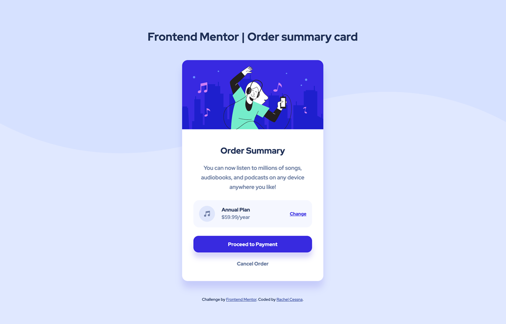
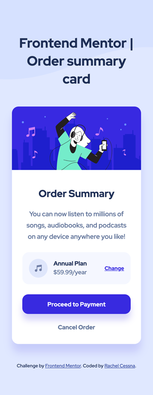

# Frontend Mentor - Order summary card solution

This is a solution to the [Order summary card challenge on Frontend Mentor](https://www.frontendmentor.io/challenges/order-summary-component-QlPmajDUj). Frontend Mentor challenges help you improve your coding skills by building realistic projects. 

## Table of contents

- [Overview](#overview)
  - [The challenge](#the-challenge)
  - [Screenshot](#screenshot)
  - [Links](#links)
- [My process](#my-process)
  - [Built with](#built-with)
  - [What I learned](#what-i-learned)
  - [Useful resources](#useful-resources)
- [Author](#author)

## Overview

### The challenge

Users should be able to:

- See hover states for interactive elements

### Screenshot

#### Desktop Layout

#### Mobile Layout

### Links

- Solution URL: [GitHub Repo](https://github.com/cessnar516/FM-order-summary-component)
- Live Site URL: [GitHub Pages](https://cessnar516.github.io/FM-order-summary-component/)

## My process

### Built with

- Semantic HTML5 markup
- SASS
- Flexbox
- Mobile-first workflow

### What I learned

I used nested flex containers to achieve the layout for this challenge. The body is set to `display: flex` in order to center all of the content on the page. The `
` containing the music icon, pricing information, and change link is also a flex container and uses `justify-content: space-between` to align the information on the outside edges of the card. Finally, the `
` also uses flex to align the icon and pricing information. This challenge really helped me develop a deeper understanding of the various flex properties and how they can be used together to achive the desired layout. 

### Useful resources

- [A Complete Guide to Flexbox](https://css-tricks.com/snippets/css/a-guide-to-flexbox/) - This is a great resource for understanding flexbox, and it provides lots of code examples and illustrations.
- [HTML Validator](https://validator.w3.org/) - It's always a good idea to validate your HTML to check for errors, and this is a great tool you can use with a live site, uploaded file, or you can also paste your code in. 

## Author

- LinkedIn - [Rachel Cessna](https://www.linkedin.com/in/rachelacessna/)
- Frontend Mentor - [@cessnar516](https://www.frontendmentor.io/profile/cessnar516)
- CodePen - [@cessnar](https://codepen.io/cessnar)
